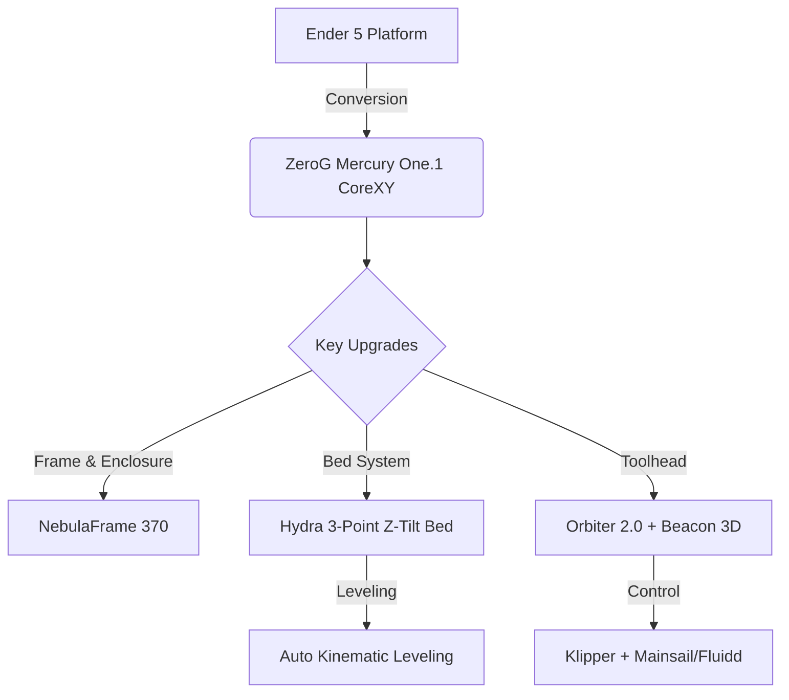
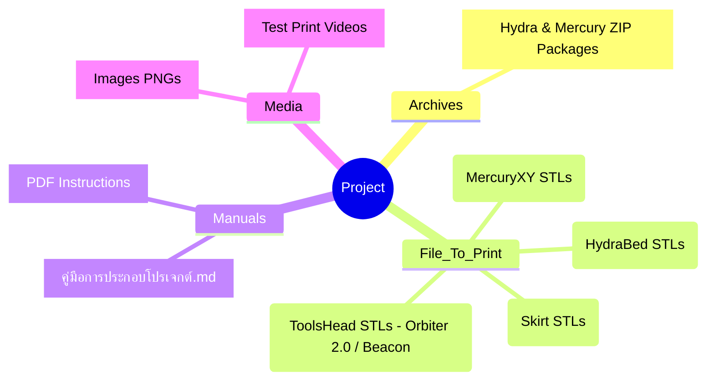

# 🚀 ZeroG MercuryOne.1 x NebulaFrame 370 x Hydra Bed

**Handmade by a Thai Maker 🇹🇭 (Icezaza)**

---

## 📖 1. Project Overview (ภาพรวมของโปรเจกต์)

โปรเจกต์นี้เป็นการนำเครื่องพิมพ์ 3 มิติตระกูล Ender 5 (หรือใกล้เคียง) มาอัปเกรดแบบยกเครื่อง (Conversion) เพื่อให้สามารถพิมพ์งานด้วยความเร็วสูง (>600 mm/s) และรองรับเส้นพลาสติกวิศวกรรม (Engineering Filaments) เช่น ABS, ASA, PC ได้ดียิ่งขึ้น

- **ZeroG Mercury One.1:** เปลี่ยนระบบการเคลื่อนที่เป็นแบบ CoreXY ทำให้น้ำหนักเบาและเคลื่อนที่ได้เร็ว
- **NebulaFrame 370:** โครงสร้างเฟรมแบบตู้ปิด (Enclosure) ช่วยควบคุมอุณหภูมิห้องพิมพ์และลดการสั่นสะเทือน
- **Hydra Bed System:** ระบบฐานพิมพ์ 3 จุดแบบอิสระ (Z-Tilt) ปรับระดับฐานพิมพ์อัตโนมัติ 100%
- **Klipper Firmware:** เฟิร์มแวร์อัจฉริยะที่ช่วยประมวลผลขั้นสูง (Input Shaper, Pressure Advance)

---

## 📊 2. System Architecture

## ✨ 3. Highlights

| ⚙️ Hardware / System | 📝 Description |
| :--- | :--- |
| ⚡ **Motion System** | CoreXY Kinematics (capable of >600mm/s speeds) |
| 🔥 **Bed Leveling** | Hydra 3-Point Z-Tilt Kinematic Bed System |
| 🏗️ **Enclosure** | NebulaFrame 370 (Rigid, optimized for ABS/ASA/PC) |
| 🛠️ **Toolhead** | Custom Mount + Orbiter 2.0 Extruder + Beacon 3D |

---

## 📂 4. Repository Map (โครงสร้างไฟล์)

โครงสร้างโฟลเดอร์ใน Repository อัปเดตล่าสุด:

---

## 🛠️ 5. Quick Start & Assembly

| Step | Action | Path/Folder |
| :---: | :--- | :--- |
| **1️⃣** | **อ่านคู่มือประกอบ** (Read the Guide) | 📖 `Manuals/คู่มือการประกอบโปรเจกต์.md` |
| **2️⃣** | **สั่งพิมพ์ชิ้นส่วนพลาสติก** (Print Parts) *(แนะนำ ABS/ASA: 4 Walls, 40% Infill)* | 🖨️ `File_To_Print/` |
| **3️⃣** | **ประกอบชิ้นส่วน และโครงเครื่อง** (Assemble) | 🔧 *ดูตามคู่มือ PDF และคู่มือในโฟลเดอร์* |
| **4️⃣** | **ติดตั้งเฟิร์มแวร์ & คาลิเบรต** (Firmware) | 💾 `Archives/` (แตกไฟล์ ZIP อ้างอิง) |
| **5️⃣** | **ดูรูปภาพประกอบและวิดีโอทดสอบ** (Media) | 📷 `Media/` |

---

**🙌 Credits:** 
[ZeroG Community](https://github.com/ZeroGDesign) | Thai Maker Community (Icezaza)

*⭐ If you like this project, please give it a star!*

