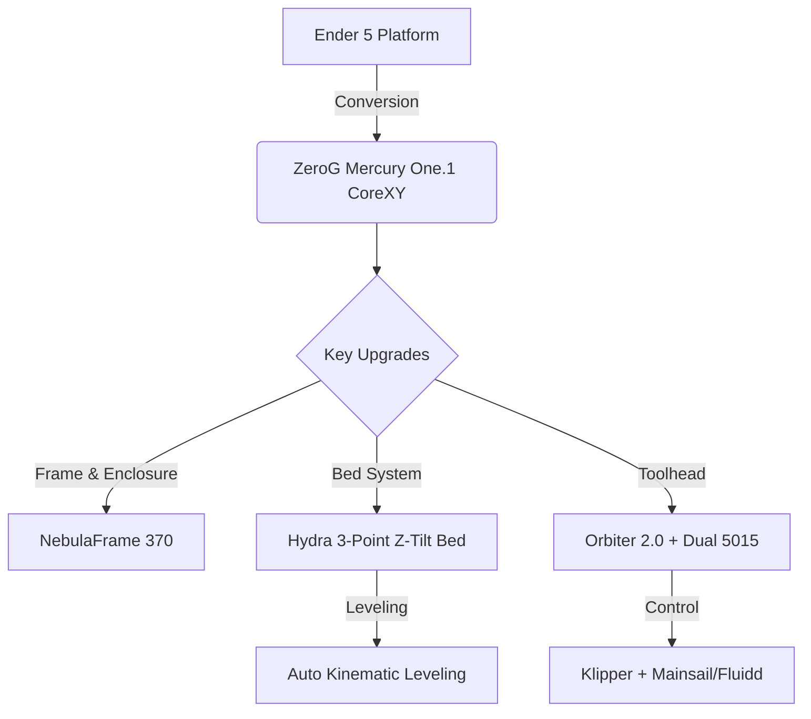
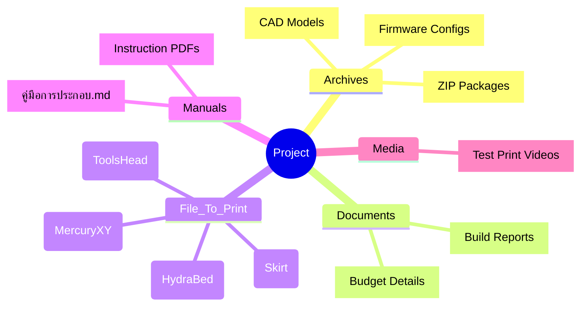

# 🚀 ZeroG MercuryOne.1 x NebulaFrame 370 x Hydra Bed

**Handmade by a Thai Maker 🇹🇭**

---

## 📊 System Architecture

## ✨ Highlights

| ⚙️ Hardware / System | 📝 Description |
| :--- | :--- |
| ⚡ **Motion System** | CoreXY Kinematics (capable of >600mm/s speeds) |
| 🔥 **Bed Leveling** | Hydra 3-Point Z-Tilt Kinematic Bed System |
| 🏗️ **Enclosure** | NebulaFrame 370 (Rigid, optimized for ABS/ASA/PC) |
| 🛠️ **Toolhead** | Custom Mount + Orbiter 2.0 Extruder + Beacon 3D |

---

## 📂 Repository Map

---

## 🛠️ Quick Start

| Step | Action | Path/Folder |
| :---: | :--- | :--- |
| **1️⃣** | **อ่านคู่มือประกอบ** (Read the Guide) | 📖 `Manuals/คู่มือการประกอบโปรเจกต์.md` |
| **2️⃣** | **สั่งพิมพ์ชิ้นส่วนพลาสติก** (Print Parts) *(แนะนำ ABS/ASA: 4 Walls, 40% Infill)* | 🖨️ `File_To_Print/` |
| **3️⃣** | **ประกอบชิ้นส่วน และโครงเครื่อง** (Assemble) | 🔧 *ดูตามคู่มือ PDF และไฟล์ CAD* |
| **4️⃣** | **ติดตั้งเฟิร์มแวร์ & คาลิเบรต** (Firmware) | 💾 `Archives/` (แตกไฟล์ ZIP เฟิร์มแวร์) |

---

**🙌 Credits:** 
[ZeroG Community](https://github.com/ZeroGDesign) | Thai Maker Community

*⭐ If you like this project, please give it a star!*

