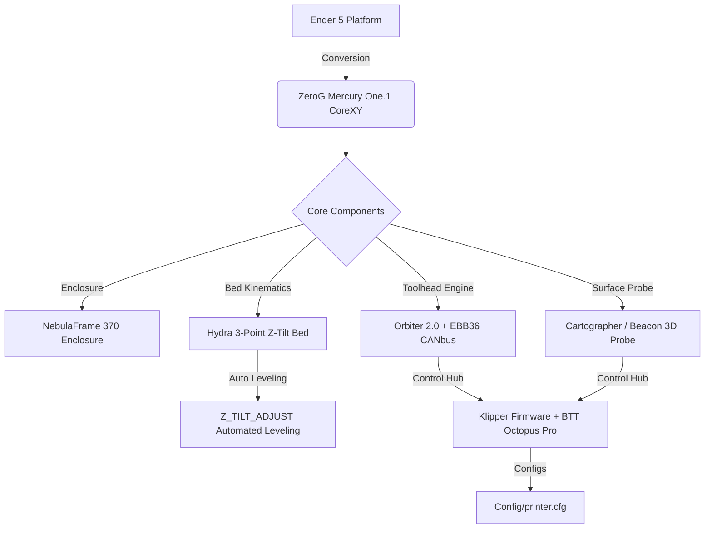
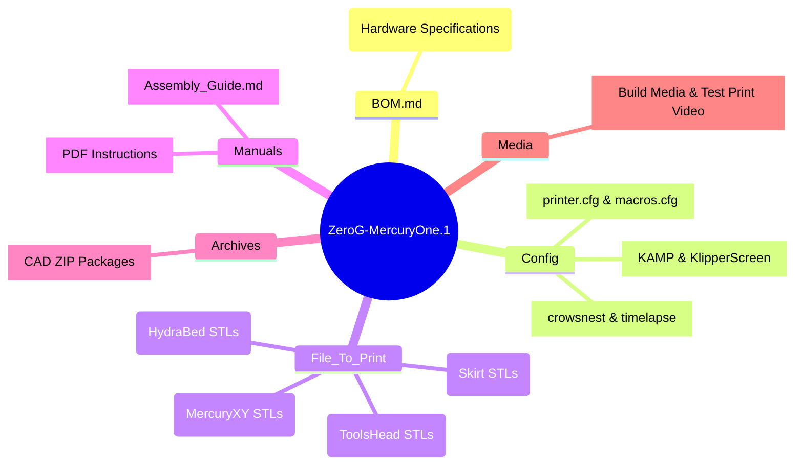

<div align="center">

# 🚀 ZeroG MercuryOne.1 x NebulaFrame 370 x Hydra Bed

### *High-Speed CoreXY 3D Printer Conversion Platform*

**Handmade with ❤️ by Icezaza**

[](https://github.com/ZeroGDesign)
[](Config/printer.cfg)
[](Manuals/Assembly_Guide.md)
[](BOM.md)
[](BOM.md)
[](LICENSE)

</div>

---

## 📖 1. Project Overview

This project is a comprehensive **CoreXY conversion** platform for **Ender 5 / Ender 5 Pro / Ender 5 Plus** 3D printers. It elevates print speeds beyond **600 mm/s** with accelerations up to **20,000 mm/s²**, designed specifically for reliable high-temperature engineering filament printing (**ABS, ASA, PC**).

### 🔑 Core Pillars

1. **⚡ ZeroG Mercury One.1 (CoreXY Kinematics):**  
   Converts stock single-axis movement into a lightweight, high-acceleration **CoreXY** gantry system for fast, precise motion.
2. **🏗️ NebulaFrame 370 (High-Temp Enclosure):**  
   Sealed acrylic/polycarbonate enclosure frame maintaining ambient chamber temperatures to prevent thermal warping in ABS, ASA, and PC prints.
3. **🔥 Hydra Bed System (3-Point Independent Z-Tilt):**  
   Kinematic **3-Point Z-Tilt** bed mechanism driven by 3 independent Z stepper motors for 100% automated bed tramming and leveling.
4. **🧠 Advanced Klipper Ecosystem:**  
   Powered by a **BigTreeTech Octopus Pro (STM32H723)** controller, **BTT EBB36 CANbus** toolhead MCU, and **Cartographer / Beacon 3D Probe** with pre-configured **KAMP (Klipper Adaptive Meshing & Purging)** and **ShakeTune**.

---

## 📊 2. Technical Specifications

| Specification / Parameter | Details & Hardware Model |
| :--- | :--- |
| **Print Kinematics** | CoreXY Kinematics (ZeroG Mercury One.1) |
| **Max Speed & Acceleration** | **Speed:** >600 mm/s \| **Acceleration:** 20,000 mm/s² |
| **Main Controller** | BigTreeTech Octopus Pro (STM32H723, 32-bit @ 550MHz) |
| **Toolhead MCU** | BigTreeTech EBB36 v1.2 (CANbus Interface) |
| **X/Y Motor Drivers** | 2x TMC5160 Pro (SPI Mode @ 1.97A Run Current) |
| **Z Motor Drivers** | 3x TMC2209 (UART Mode @ 1.45A Run Current) |
| **X/Y Motors** | LDO-42STH48-2804AH-R (High-Torque 0.9° Steppers) |
| **Z Motors** | 3x NEMA17 Steppers (Hydra 3-Point Z-Tilt Drive) |
| **Extruder** | Orbiter 2.0 Dual-Drive Direct Extruder |
| **Bed Surface Scanner** | Cartographer 3D / Beacon 3D Surface Scanner |
| **Part Cooling** | 5015 High-Static Pressure Blower Fan (24V) |
| **Firmware & Software** | Klipper + Moonraker + Mainsail + KAMP + KlipperScreen |

---

## 🏗️ 3. System Architecture & Workflows



---

## 📂 4. Repository Structure



### 📋 Folder Responsibilities

* 🔩 **[`BOM.md`](BOM.md):** Complete Bill of Materials specifying fasteners, linear rails, belts, motors, and electronics.
* 💾 **[`Config/`](Config/):** Production Klipper configuration files (`printer.cfg`, `macros.cfg`, `KAMP_Settings.cfg`, `KlipperScreen.conf`).
* 🖨️ **[`File_To_Print/`](File_To_Print/):** Categorized 3D printable STL files (`HydraBed/`, `MercuryXY/`, `Skirt/`, `ToolsHead/`).
* 📖 **[`Manuals/`](Manuals/):** Markdown assembly guide ([`Assembly_Guide.md`](Manuals/Assembly_Guide.md)) and official PDF manuals.
* 📦 **[`Archives/`](Archives/):** Compressed archives containing original CAD models.
* 📷 **[`Media/`](Media/):** Video demonstrations and project media assets.

---

## 🛠️ 5. Quick Start & Assembly Guide

### 1️⃣ Step 1: Review Hardware Requirements
Inspect the complete Bill of Materials for screws, heat-set inserts, MGN12H linear rails, and motor specifications in 🔩 **[BOM.md](BOM.md)**.

### 2️⃣ Step 2: Print Required Parts
Slice STL files from 🖨️ **[File_To_Print/](File_To_Print/)** with recommended settings:
* **Recommended Material:** ABS or ASA (High thermal resistance)
* **Wall Loops / Perimeters:** 4–5 walls
* **Top / Bottom Layers:** 5 layers
* **Infill:** 40% (Gyroid or Grid pattern)

### 3️⃣ Step 3: Assemble Mechanical Gantry & Frame
Follow step-by-step assembly instructions in 📖 **[Manuals/Assembly_Guide.md](Manuals/Assembly_Guide.md)**.

### 4️⃣ Step 4: Install Klipper Configuration
Copy configuration files from 💾 **[Config/](Config/)** into your Klipper environment (`printer_data/config/`).

### 5️⃣ Step 5: Execute Machine Calibration
Run Klipper calibration macros via console:

```gcode
# 1. Automatic 3-Point Z-Tilt Leveling
Z_TILT_ADJUST

# 2. Bed Mesh Calibration
BED_MESH_CALIBRATE

# 3. Hotend & Heated Bed PID Tuning
PID_CALIBRATE HEATER=extruder TARGET=240
PID_CALIBRATE HEATER=heater_bed TARGET=100

# 4. Resonance Testing & Input Shaper Calibration
SHAKETUNE
```

---

## ❓ 6. Troubleshooting & FAQs

<details>
<summary><b>❓ Why is ABS or ASA required for printed components?</b></summary>
<br>
Inside the NebulaFrame 370 enclosure, ambient chamber temperatures reach 50–60°C. Parts printed in PLA or PETG will soften and deform under heat, causing gantry misalignment and loose belt tension.
</details>

<details>
<summary><b>❓ What causes Z-Tilt leveling errors or motor binding?</b></summary>
<br>
Verify that motor pin definitions and coordinates for <code>stepper_z</code>, <code>stepper_z1</code>, and <code>stepper_z2</code> in <code>printer.cfg</code> match the physical lead screw positions on your machine.
</details>

<details>
<summary><b>❓ What printing speeds can be reliably achieved?</b></summary>
<br>
While TMC5160 drivers and LDO high-torque steppers support travel speeds over 600 mm/s, high-quality production printing is recommended between 250–450 mm/s for optimal surface finish on ABS/ASA.
</details>

---

## 🤝 7. Credits & Acknowledgements

Special thanks to the open-source community:
* 🚀 **[ZeroG Design Community](https://github.com/ZeroGDesign):** Creators of the ZeroG Mercury One.1 CoreXY platform.
* ⚙️ **[Klipper Project](https://www.klipper3d.org/):** High-performance 3D printer firmware.
* 🇹🇭 **Thai Maker Community (Icezaza):** Design customization and project documentation.

---

<div align="center">

**📄 License:** [CC BY-NC-SA 4.0](https://creativecommons.org/licenses/by-nc-sa/4.0/) & [CC0 1.0 Universal](LICENSE)  

*⭐ If you find this project helpful, please give it a star on GitHub!*

</div>
