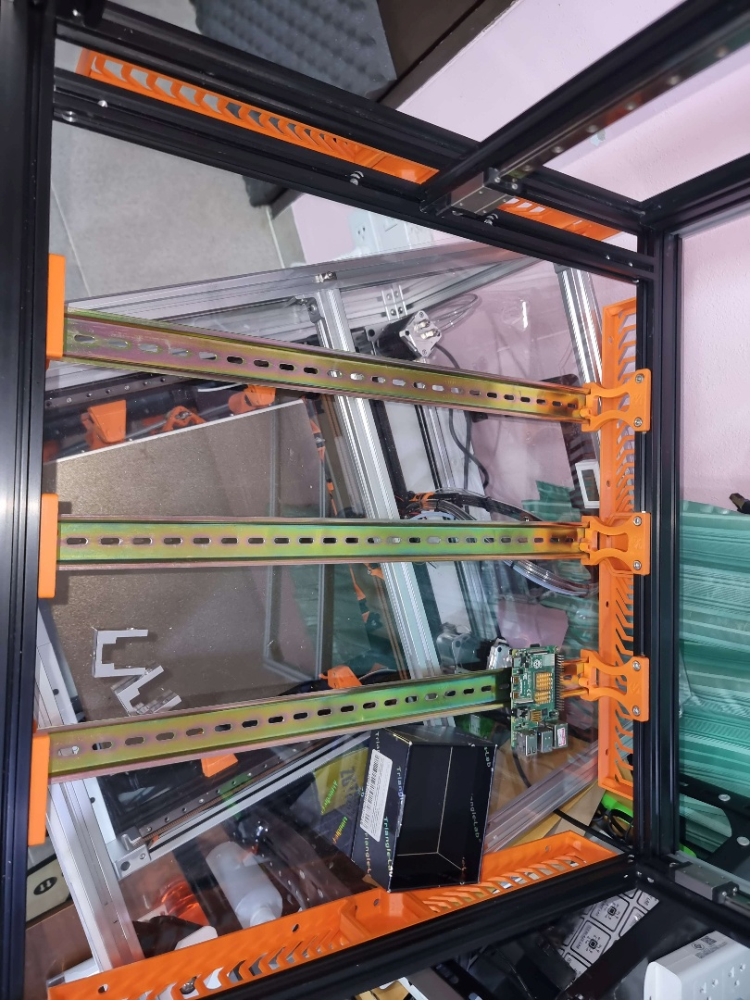
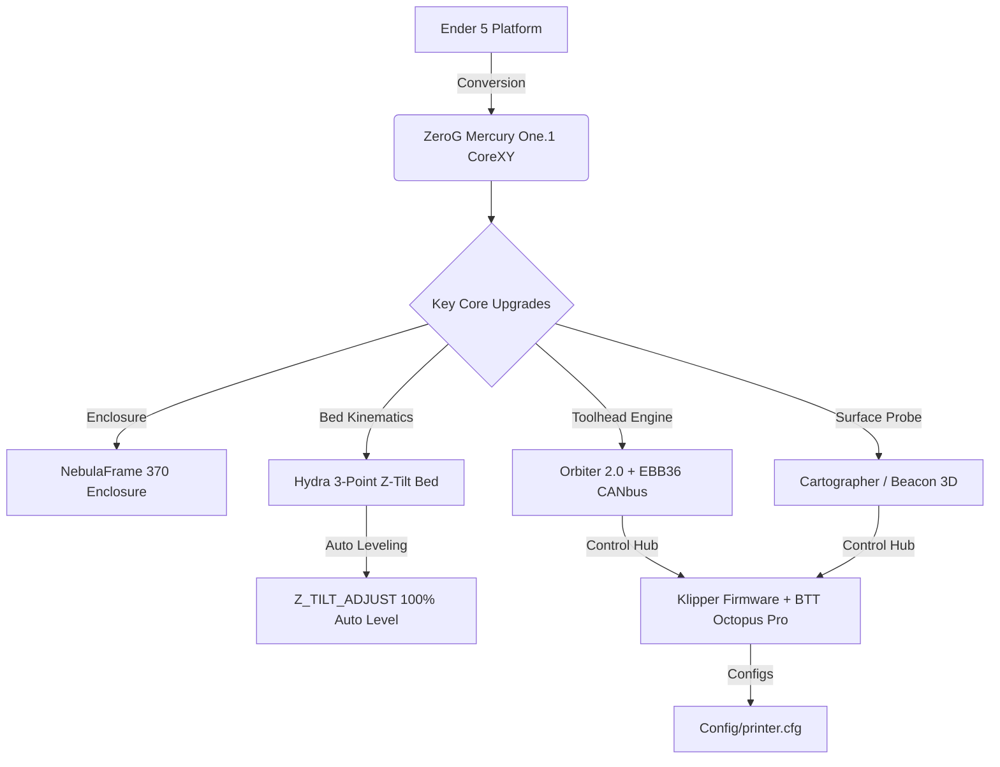
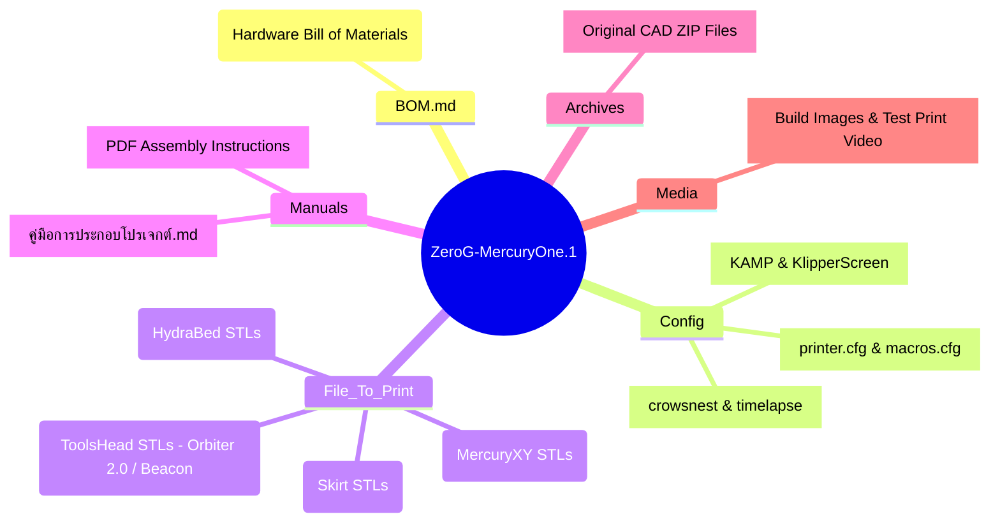
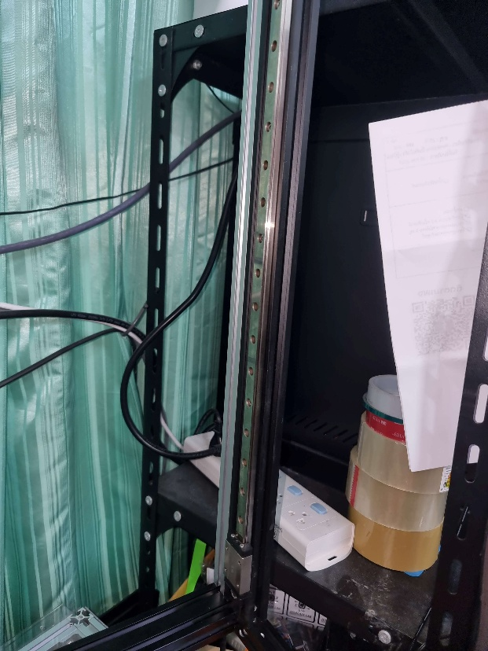
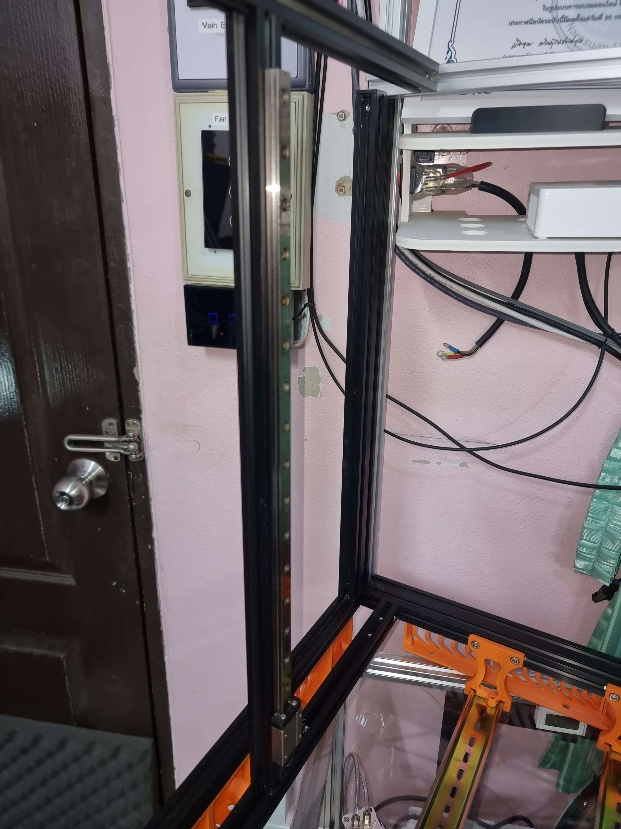
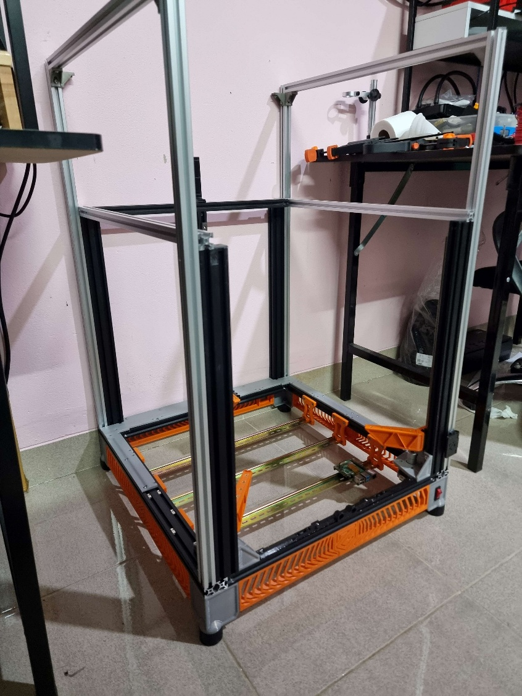

<div align="center">

# 🚀 ZeroG MercuryOne.1 x NebulaFrame 370 x Hydra Bed

### *High-Speed CoreXY 3D Printer Conversion Platform*

**Handmade with ❤️ by a Thai Maker 🇹🇭 (Icezaza)**

[](https://github.com/ZeroGDesign)
[](Config/printer.cfg)
[](Manuals/คู่มือการประกอบโปรเจกต์.md)
[](BOM.md)
[](BOM.md)
[](LICENSE)

---

### 🌟 Project Gallery



</div>

---

## 📖 1. Project Overview (ภาพรวมโปรเจกต์)

โปรเจกต์นี้เป็นการนำเครื่องพิมพ์ 3 มิติตระกูล **Ender 5 / Ender 5 Pro / Ender 5 Plus** มาดัดแปลงอัปเกรดแบบยกเครื่อง (Full Conversion) เพื่อก้าวข้ามขีดจำกัดเดิม ยกระดับความเร็วในการพิมพ์สูงถึง **>600 mm/s** พร้อมอัตราเร่งสูงสุด **20,000 mm/s²** และรองรับการพิมพ์พลาสติกวิศวกรรมอุณหภูมิสูง (Engineering Filaments) เช่น **ABS, ASA, PC** ได้อย่างสมบูรณ์แบบ

### 🔑 องค์ประกอบสำคัญ 4 ประการ (Core Pillars)

1. **⚡ ZeroG Mercury One.1 (CoreXY Kinematics):**  
   เปลี่ยนระบบการเคลื่อนที่จากแกน X/Y แบบเดิม มาเป็นโครงสร้าง **CoreXY** ทำให้น้ำหนักส่วนกะทัดรัด เคลื่อนที่ได้รวดเร็ว แม่นยำ และไร้การสั่นไหว
2. **🏗️ NebulaFrame 370 (High-Temp Enclosure):**  
   โครงสร้างตู้ปิดอะคริลิค/โพลีคาร์บอเนตช่วยกักเก็บความร้อน ป้องกันยวดหรือหดตัวของเส้นพลาสติก ABS/ASA และลดเสียงรบกวนขณะพิมพ์เร็ว
3. **🔥 Hydra Bed System (3-Point Independent Z-Tilt):**  
   ระบบฐานพิมพ์แบบ **Kinematic 3-Point Z-Tilt** ควบคุมด้วยสเต็ปเปอร์มอเตอร์แกน Z 3 ตัวแยกอิสระ สามารถปรับระนาบฐานพิมพ์ให้อยู่ในแนวระนาบได้อย่างสมบูรณ์แบบอัตโนมัติ 100%
4. **🧠 Advanced Klipper Ecosystem:**  
   ขับเคลื่อนด้วยเมนบอร์ด **BTT Octopus Pro (STM32H723)** ร่วมกับ **BTT EBB36 CANbus** บนหัวฉีด และเซนเซอร์วัดฐานพิมพ์ **Cartographer / Beacon 3D Probe** พร้อมเปิดใช้งาน **KAMP (Klipper Adaptive Meshing & Purging)** และ **ShakeTune**

---

## 📊 2. Technical Specifications (สเปกทางเทคนิค)

| Specification / Parameter | Details & Hardware Model |
| :--- | :--- |
| **Print Kinematics** | CoreXY Kinematics (ZeroG Mercury One.1) |
| **Max Speed & Accel** | **Speed:** >600 mm/s \| **Acceleration:** 20,000 mm/s² |
| **Main Controller** | BigTreeTech Octopus Pro (STM32H723, 32-bit @ 550MHz) |
| **Toolhead MCU** | BigTreeTech EBB36 v1.2 (CANbus Connection) |
| **X/Y Motor Drivers** | 2x TMC5160 Pro (SPI Mode @ 1.97A Run Current) |
| **Z Motor Drivers** | 3x TMC2209 (UART Mode @ 1.45A Run Current) |
| **X/Y Motors** | LDO-42STH48-2804AH-R (High Torque 0.9° Steppers) |
| **Z Motors** | 3x NEMA17 Steppers (Hydra 3-Point Z-Tilt) |
| **Extruder** | Orbiter 2.0 Dual-Drive Direct Extruder |
| **Bed Surface Scanner** | Cartographer 3D / Beacon 3D Surface Scanner |
| **Part Cooling** | 5015 High-Static Pressure Blower Fan (24V) |
| **Firmware & Software** | Klipper + Moonraker + Mainsail + KAMP + KlipperScreen |

---

## 🏗️ 3. System Architecture & Workflows



---

## 📂 4. Repository Structure (โครงสร้างไฟล์)



### 📋 สรุปหน้าที่ของโฟลเดอร์หลัก

* 🔩 **[`BOM.md`](BOM.md):** ตารางรายละเอียดอุปกรณ์ฮาร์ดแวร์ น็อต ราง Linear Rail สายพาน และสเปกมอเตอร์
* 💾 **[`Config/`](Config/):** ไฟล์คอนฟิก Klipper ที่ปรับแต่งใช้งานจริง (`printer.cfg`, `macros.cfg`, `KAMP_Settings.cfg`, `KlipperScreen.conf`)
* 🖨️ **[`File_To_Print/`](File_To_Print/):** ชิ้นส่วน STL สำหรับพิมพ์ 3 มิติ แยกหมวดหมู่ชัดเจน (`HydraBed/`, `MercuryXY/`, `Skirt/`, `ToolsHead/`)
* 📖 **[`Manuals/`](Manuals/):** คู่มือขั้นตอนการประกอบภาษาไทยและไฟล์อ้างอิง PDF อย่างเป็นทางการ
* 📦 **[`Archives/`](Archives/):** ไฟล์บีบอัด CAD Model ต้นฉบับ
* 📷 **[`Media/`](Media/):** คลังรูปภาพประกอบและวิดีโอทดสอบการพิมพ์งาน

---

## 🛠️ 5. Quick Start & Assembly Guide (ขั้นตอนการเริ่มต้น)

### 1️⃣ ขั้นตอนที่ 1: เตรียมอุปกรณ์ตามตาราง BOM
ตรวจสอบรายการอุปกรณ์ น็อต M3/M4/M5, Brass Heat-Set Inserts, ราง Linear Guide MGN12H และมอเตอร์ที่ต้องใช้จากเอกสาร 🔩 **[BOM.md](BOM.md)**

### 2️⃣ ขั้นตอนที่ 2: สั่งพิมพ์ชิ้นส่วนพลาสติก (3D Printing Parts)
นำไฟล์ STL จากโฟลเดอร์ 🖨️ **[File_To_Print/](File_To_Print/)** ไปตั้งค่าใน Slicer:
* **วัสดุที่แนะนำ:** ABS หรือ ASA (ทนทานความร้อนสูง)
* **Wall Loops / Perimeters:** 4–5 ชั้น
* **Top / Bottom Layers:** 5 ชั้น
* **Infill:** 40% (Gyroid / Grid)

### 3️⃣ ขั้นตอนที่ 3: ประกอบโครงสร้างเครื่อง
ปฏิบัติตามขั้นตอนใน 📖 **[คู่มือการประกอบโปรเจกต์.md](Manuals/คู่มือการประกอบโปรเจกต์.md)** และไฟล์ PDF อ้างอิงในโฟลเดอร์ `Manuals/`

### 4️⃣ ขั้นตอนที่ 4: ติดตั้ง Klipper Firmware & Configuration
นำไฟล์ทั้งหมดในโฟลเดอร์ 💾 **[Config/](Config/)** ไปวางไว้ที่โฟลเดอร์ `printer_data/config/` บน Klipper Host (Raspberry Pi / CB1)

### 5️⃣ ขั้นตอนที่ 5: คาลิเบรตระบบ (Calibration Commands)
รันคำสั่งคาลิเบรตผ่าน Klipper Console ตามลำดับ:

```gcode
# 1. ปรับระดับฐานพิมพ์อัตโนมัติ 3 จุด
Z_TILT_ADJUST

# 2. ทำแผนที่ฐานพิมพ์
BED_MESH_CALIBRATE

# 3. จูนความร้อน Hotend & Heated Bed
PID_CALIBRATE HEATER=extruder TARGET=240
PID_CALIBRATE HEATER=heater_bed TARGET=100

# 4. ทดสอบความถี่การสั่นสะเทือน (Input Shaper)
SHAKETUNE
```

---

## 🖼️ 6. Photo Gallery (แกลเลอรีภาพถ่ายการประกอบ)

| Component Assembly | Details |
| :---: | :--- |
|  | **Toolhead & Gantry Alignment:** การติดตั้งชุดหัวฉีด Orbiter 2.0 ร่วมกับราง MGN12H |
|  | **Hydra Z-Tilt Kinematic Bed:** ระบบฐานพิมพ์ 3 จุดอิสระ ปรับระดับอัตโนมัติ |
|  | **NebulaFrame 370 Enclosure:** โครงตู้ปิดกักเก็บความร้อนสำหรับพิมพ์พลาสติก ABS/ASA |

---

## ❓ 7. Troubleshooting & FAQs (คำถามที่พบบ่อย)

<details>
<summary><b>❓ 1. ทำไมถึงแนะนำให้ใช้พลาสติก ABS/ASA พิมพ์ชิ้นส่วน?</b></summary>
<br>
เนื่องจากเครื่องพิมพ์ระบบตู้ปิด (NebulaFrame 370) จะมีความร้อนสะสมภายในตู้สูงถึง 50–60°C ชิ้นส่วนที่พิมพ์จาก PLA หรือ PETG จะอ่อนตัวและเสียรูปทรง ทำให้เกิดอาการโครงสร้างเบี้ยวหรือสายพานหย่อนได้
</details>

<details>
<summary><b>❓ 2. Z-Tilt Adjust ไม่ผ่าน หรือมอเตอร์ขัดกัน เกิดจากอะไร?</b></summary>
<br>
ตรวจสอบตำแหน่งลำดับพินและพิกัดพอยท์ของมอเตอร์ <code>stepper_z</code>, <code>stepper_z1</code>, และ <code>stepper_z2</code> ใน <code>printer.cfg</code> ให้ตรงกับตำแหน่งจริงของลีดสกรูแต่ละต้น
</details>

<details>
<summary><b>❓ 3. สามารถพิมพ์งานที่ความเร็วเท่าใดได้บ้าง?</b></summary>
<br>
สเปกฮาร์ดแวร์ TMC5160 + LDO High Torque Stepper รองรับการเดินทางได้สูงสุด >600 mm/s แต่สำหรับการพิมพ์งานจริง แนะนำความเร็ว 250–450 mm/s บนพลาสติก ABS/ASA เพื่อให้ได้คุณภาพผิวงานที่ดีเยี่ยม
</details>

---

## 🤝 8. Credits & Acknowledgements

ขอขอบคุณชุมชนและโครงการโอเพ่นซอร์สผู้สร้างแรงบันดาลใจ:
* 🚀 **[ZeroG Design Community](https://github.com/ZeroGDesign):** ผู้สร้างสรรค์โปรเจกต์ ZeroG Mercury One.1 CoreXY
* ⚙️ **[Klipper Project](https://www.klipper3d.org/):** ระบบเฟิร์มแวร์ประสิทธิภาพสูง
* 🇹🇭 **Thai Maker Community (Icezaza):** ผู้ออกแบบ ปรับแต่ง และเรียบเรียงเอกสารสำหรับเมกเกอร์ชาวไทย

---

<div align="center">

**📄 License:** [CC BY-NC-SA 4.0](https://creativecommons.org/licenses/by-nc-sa/4.0/) & [CC0 1.0 Universal](LICENSE)  

*⭐ หากถูกใจโปรเจกต์นี้ อย่าลืมกด Star บน GitHub เพื่อเป็นกำลังใจให้ผู้พัฒนาด้วยนะครับ!*

</div>
